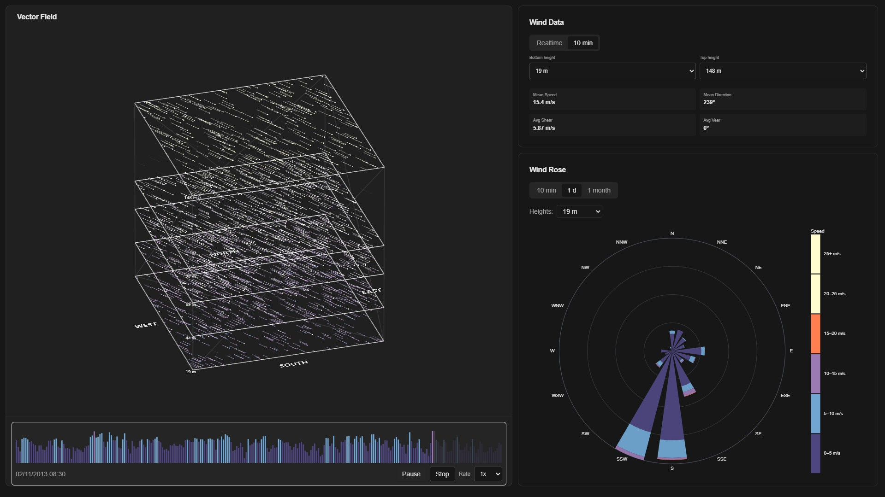

# Wind vector field renderer from LiDAR wind vertical profile data

## Description
Interactive visualization of the vertical wind profile from LiDAR data: a 3D vector field with particles, a data panel, and a wind rose. Data is aggregated by height levels; time ranges can be switched and the timeline can be played back.

## Demo - [Open on vercel](https://example.com)

## Preview

## Functionality
- 3D wind vector field (Three.js + React Three Fiber), scaled to actual LiDAR height levels
- Visualization of height slices and direction labels
- Wind Rose panel with periods (10 min, 1 day, 1 month) and the ability to select a specific height or combine all heights
- Wind Data panel with Realtime and 10‑min averages: speed, direction, vertical shear, and veer
- Playback timeline with average-speed-based coloring, Play/Pause/Stop, and adjustable playback rate

## Data handling
- Typical LiDAR parameters are used: horizontal and vertical wind speeds (mean, std, max), wind direction, turbulence intensity (TI), and height levels
- Data source: open UCC dataset of vertical wind profiles (10‑min and ~23‑s resolution) — see Zenodo: [Vertical profiles of urban wind speed…](https://zenodo.org/records/6807666)
- Currently, data is loaded from a local CSV asset (hardcoded) `src/data/05092013-03122013_10min_res.csv` and parsed by a simple CSV parser with no backend

## Tech stack
- React, TypeScript, Vite
- three.js, @react-three/fiber, @react-three/drei
- Tailwind CSS v4
- Zustand 5 for state management
- UI: shadcn/ui
- Themes: `next-themes`
- Architecture: Feature‑Sliced Design (FSD) — `entities`, `widgets`, `shared`, `pages`, `app`

## Workflow
This project was built using an AI‑assisted workflow (Cursor + GPT).
